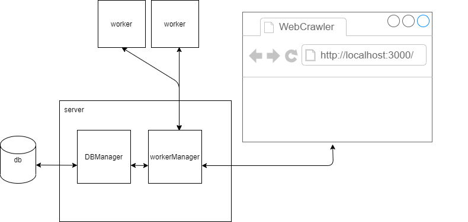

# WebCrawler

## What does WebCrawler do?

#### **Scrape the web according to:**

- The url to start scraping from.
- The maximum depth to crawl down to from the start url.
- The max number of pages for the entire scrape job.

  (Stop crawling a job when it reaches maxDepth or maxPages, whichever comes first.)

#### **Every scraped page has:**

1.  title - The document.title of the page.
2.  depth - Current depth being scraped.
3.  url - The URL that was scraped.
4.  links - All hrefs in the anchor tags in the page.

## Architecture:

#### **New scrape job flow**

## Quick Start:

1. run `git clone https://github.com/PerachBD/WebCrawler.git`
2. run `npm i && npm start`

## Stack:

- NodeJS
- React
- Express
- Web Storage

### Main packages:

- Socket.IO - enables real-time bidirectional event-based communication.
- Lowdb - Small JSON database for Node, Electron and the browser. Powered by Lodash.
- node-html-parser - Fast HTML Parser is a very fast HTML parser. Which will generate a simplified DOM tree, with basic element query support.
